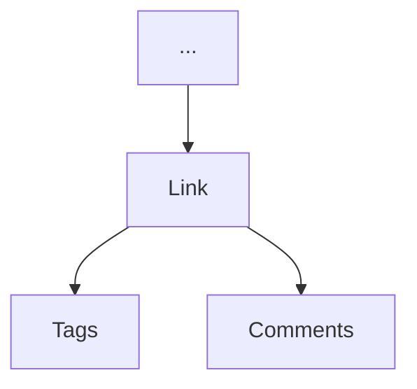
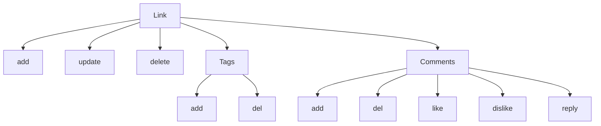

# Link module
## Simple management of links

### Actions

### Requisitos
1. Link
   1. Create
      1. workspace_id
         1. [ ] required
         2. [ ] exist
      2. user_id
         1. [ ] required
         2. [ ] exist
      3. name
         1. [ ] required
         2. [ ] min carac: 3
         3. [ ] max carac: 200
      4. link_url
         1. [ ] required
   2. Update
      1. id
         1. [ ] required
         2. [ ] valid
      2. name
         1. [ ] required
         2. [ ] min carac: 3
         3. [ ] max carac: 200
      3. link_url
         1. [ ] required
   3. Delete
      1. id
         1. [ ] required
2. Tag
   1. Create
      1. link_id
         1. [ ] required 
      2. tag
         1. [ ] required
         2. [ ] min length: 3
         3. [ ] max length: 14
   2. Delete
      1. id
         1. [ ] required
3. Comments
   1. Create
      1. link_id
         1. [ ] required
         2. [ ] valid
      2. user_id
         1. [ ] required
         2. [ ] valid
      3. parent_id
         1. [ ] valid
      4. message
         1. [ ] required
   2. Delete
      1. id
         1. [ ] required
   3. Like
      1. id
         1. [ ] required
   4. Dislike
      1. id
         1. [ ] required
   5. Reply
      1. id
         1. [ ] required
         2. [ ] required 

